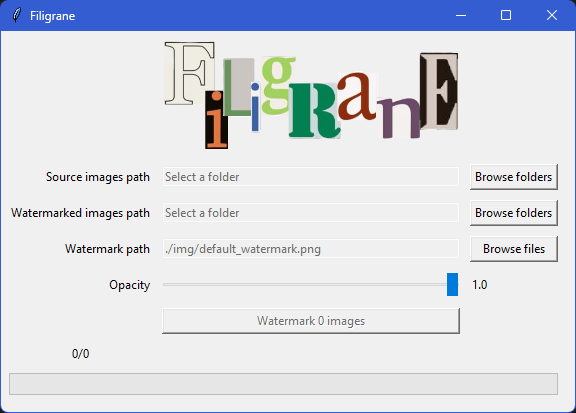

Filigrane is a software that allows you to put a watermark on a set of images. Filigrane is made with python3 and a Tkinter GUI
# Installation : 
## For users (Windows only):
* Download latest setup or portable version on https://github.com/Palasthan/Filigrane/releases
* To use the installer : 
  * Download the Filigrane-Setup-x.x.x.exe
  * Execute it
  * Follow the installation process
  * Execute filigrane.exe
* To use the portable version :
  * Unzip Filigrane.zip
  * Execute filigrane.exe

